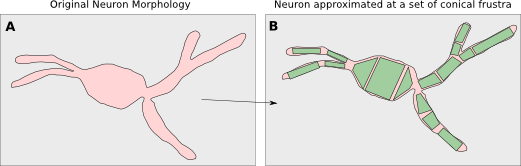

Introduction to NEURON(90 Mins):
---------------------------------

 * 30 mins presentation

   - Who am I? (1 minute)   
   - Why use NEURON? ( 5-10 mins)

	* Use-cases: What does it do?
         * What do i need to use it?
	* Resources

   - Basics of NEURON (20-25 mins):

	* 2 Parts: HOC and .mod files
         * GUI vs HOC
         * Example simulation: Single Compartment HH with current injection
	* Representing cell morphology
         * Using channels
         * Stimuli
         * Running the simulation
         * Plotting the results

 * 45 mins exercise
  
  - Based on David Sterrat and Andrew Gillies tutorial

 * 15 mins Wrap up
   
   - nrnivmodl
   - More things with NEURON: cvode,
   - Interfacing with Python (limitations)
   - other simulators - GENESIS, MOOSE
   - other options; morphforge, neuroml, nineml, neuronvisio, pynn;
   - Links to other tools

Why use NEURON ( 5-10 mins)
----------------------------
From the NEURON website (my bold type):
 
 - is a flexible and powerful **simulator of neurons and networks**
 - has important advantages over general-purpose simulators helps users **focus on important biological issues** rather than purely computational concerns
 - has a convenient user interface
 - has a **user-extendable** library of biophysical mechanisms
 - has many enhancements for **efficient network modeling**
 - offers customizable initialization and simulation flow control
 - is widely used in neuroscience research by experimentalists and theoreticians
 - is well-documented and **actively supported**
 - is **free, open source**, and runs on (almost) everything

Use-cases - What does it do? I
~~~~~~~~~~~~~~~~~~~~~~~~~~~~~~  
  * Modelling of multicompartmental neurons
     - keeps track of ion movements

  * Connections between cells through synapses
  * Defining your own channels & synapses

  * If you are interested in large networks of 'simple', single
    compartement neurons, there are other options.

Use-cases - What does it do? II
~~~~~~~~~~~~~~~~~~~~~~~~~~~~~~~  
  * For a single compartment cell with simple HH dynamics,
    you can probably write your own solver using ODE solvers in 
    matlab/python.
  
  * As your models develop more complexity:
    
    - Current dependancies e.g. intracellular Ca2+ dependant K channels
    - Solving of Cable Equations for multicompartmental neurons
    - Connections via synapses & gap junctions

  * You may find that you are reimplementing lots of mathematical solving,
    which has been already been done efficiently in NEURON.

  * MOD files provide a standard for exchanging channel descriptions
    (e.g. modeldb)

  * There is a python interface
  * Highly parallelisable (e.g. BBP) for large networks

What do i need to use it?
~~~~~~~~~~~~~~~~~~~~~~~~~  
  * It runs on most operating systems (Windows/Linux/Mac). On the NEURON website:
    
    - Windows installer
    - Mac package
    - Linux .deb, .rpm package

  * Eilif Muller has a precompiled binaries including Python support
    http://neuralensemble.org/people/eilifmuller/software.html

Resources
~~~~~~~~~
 * Active questions board
 * ModelDB
 * The NEURON Book 

Basics of NEURON (20-25 mins)
-----------------------------

Overview
~~~~~~~~

	* NEURON is complex (I will cover a lot of material in the next slides, don't worry if you don't remember all the details its the concepts that are important)
	* NEURON is old

2 Parts: HOC and NMODL files
~~~~~~~~~~~~~~~~~~~~~~~~~~~~~
 * Two main types of language:
   
    * Interpreted languages (Python/matlab) are interactive, but slow
    * Compiled languages (Fortran/C/C++/...) are fast

 * NEURON uses both:
    
   * 'HOC' - which controls the 'structure' of the simulation
   * 'NMODL' - a compiled language for specifying the dynamics of channels/synapses mathematically (e.g. Hodgkin-Huxley type channels).

HOC Interpreter
~~~~~~~~~~~~~~~
 * HOC is an interactive interpreter which controls the 'structure' of the simulation:
   
    * creating morphologies
    * defining which channels to apply and changing certain parameters (channel densities) 
    * creating stimuli: current clamps, voltage clamps
    * defining what you want to record: voltages, internal states
    * setting simulation parameters: stimulation time-steps,      
    * running the simulation

NMODL
~~~~~

 * We will discuss NMODL later...

HOC - Graphical User Interface
~~~~~~~~~~~~~~~~~~~~~~~~~~~~~~

 * NEURON can be used entirely from the commandline and with 'scripts'::

   $ nrnoc
   $ oc> 

 * NEURON also has a graphical user interface

.. code-block:: verbose
   $ nrngui	
   $ oc> 	

.. image:: src_imgs/neuron_mainmenu.gif
	:width: 10cm	

Overview of all the components
~~~~~~~~~~~~~~~~~~~~~~~~~~~~~~

.. image:: blah.png
    :width: 10

Example Simple simulation: Soma + Axon Compartment HH with current injection
~~~~~~~~~~~~~~~~~~~~~~~~~~~~~~~~~~~~~~~~~~~~~~~~~~~~~~~~~~~~~~~~~~~~~~~~~~~~

TODO: Image:

Morphologies I (Overview)
~~~~~~~~~~~~~~~~~~~~~~~~~

 * Neuron morphologies are represented as a tree of 'unbranched cylinders' called 'Sections' which describe the 'gross' morphology of the neuron. 

Morphology II ((Building & Connecting Sections)
~~~~~~~~~~~~~~~~~~~~~~~~~~~~~~~~~~~~~~~~~~~~~~~

 * 'Sections' are created with the `create <name>` command
 * Section are connected together with the `connect` function. 
 * **L**\ength and **diam**\ eter of the sections are set as properties for each section::

	
	oc> create soma
	oc> create axon_proximal
	oc> create axon_distal
	
	oc> connect soma(1.0), axon_proximal(0.0)
	oc> connect axon_proximal(1.0), axon_distal(0.0)
	
	oc> soma L = 12.3
	oc> soma diam = 12.3

	oc> axon_proximal diam = 1.0
	oc> axon_proximal L = 50

	oc> axon_proximal diam = 0.5
	oc> axon_proximal L = 20

Morphologies III (Segmentation)
~~~~~~~~~~~~~~~~~~~~~~~~~~~~~~~      

 * NEURON separates the description of the overall morphology from 
   the amount of discretisation of the simulation.
 * To solve simulations more accuratly, Sections can be subdivided into 'segments'.
 * Each segment has its own voltage and state variables
 * (Hines & Carnevale recommend using an odd number of segments)::

	oc> axon_proximal nseg = 11
	oc> axon_proximal nseg = 3

Channels I (Overview)
~~~~~~~~~~~~~~~~~~~~~

 * Neurons are interesting because of their active membrane channels
 * NEURON can handle many common use cases:
	
         - it is possible to define your own using NMODL files (not covered here)
	- it comes with some predefined channel definitions.

   
Channels II (Examples)
~~~~~~~~~~~~~~~~~~~~~~

.. image:: passive channels

.. image:: hh-type channels
 
Channels III (Using channels)
~~~~~~~~~~~~~~~~~~~~~~~~~~~~~

 * Channels are `insert`\ ed into each Section
 * Channels can have parameters that can be changed in HOC, (e.g. conduction density)
 * E.g.::
	
	oc> soma insert hh
	oc> soma insert hh
	oc> soma hh.e_rev=12

Summarising Cells:
~~~~~~~~~~~~~~~~~~

.. code-block:: verbose

	oc> soma psection()
         ...

Stimuli
~~~~~~~
         
Running the simulation
~~~~~~~~~~~~~~~~~~~~~~

Plotting the results
~~~~~~~~~~~~~~~~~~~~

