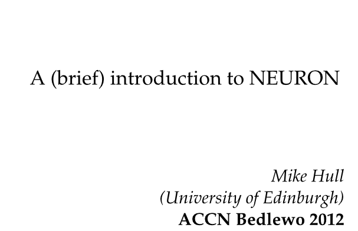
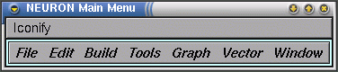
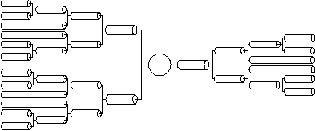
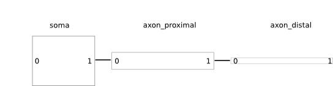
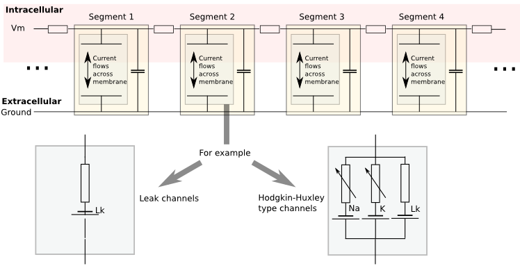
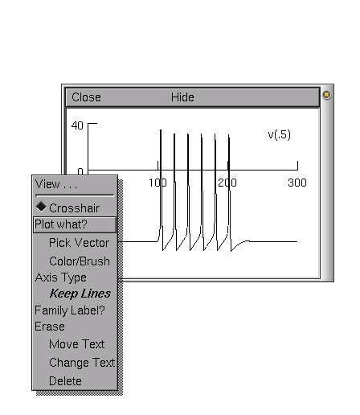

.. contents::
    :depth: 1

*(Many thanks to David Sterratt (Uni of Edinburgh) for allowing the use of his
tutorials and images)*

Why use NEURON ( 5-10 mins)
----------------------------
*(From the NEURON website, my bold type):*

 - is a flexible and powerful **simulator of neurons and networks**
 - has important advantages over general-purpose simulators helps users **focus on important biological issues** rather than purely computational concerns
 - has a convenient user interface
 - has a **user-extendable** library of biophysical mechanisms
 - has many enhancements for **efficient network modeling**
 - offers customizable initialization and simulation flow control
 - is widely used in neuroscience research by experimentalists and theoreticians
 - is well-documented and **actively supported**
 - is **free, open source**, and runs on (almost) everything

Use-cases
~~~~~~~~~
  * Modelling of multicompartmental neurons in which membrane voltage is
    calculated from ion flows across the membranes
  * Connections between cells through synapses (chemical & electrical)
  * If you are interested in large networks of 'simple', single
    compartement neurons, there are other options.

Use-cases
~~~~~~~~~
  * For a single compartment cell with simple HH dynamics, you can probably
    write your own simulation using the ODE solvers in provided matlab/python.

  * As your models develop more complexity:

    - Current dependancies e.g. K channels dependant on intracellular Ca
    - Incoorperation of the cable equation for multicompartmental neurons
    - Connections via synapses (delays)

  * You may find that you are reimplementing lots of mathematical solving,
    which has been already been done efficiently in NEURON.

  * MOD files provide a standard for exchanging channel descriptions
    (e.g. modeldb)

  * NEURON is highly parallelisable (e.g. BBP) for large networks

  * There is a python interface

What do i need to use it?
~~~~~~~~~~~~~~~~~~~~~~~~~  

  * It runs on most operating systems (Windows/Linux/Mac). On the NEURON website:
    - Windows installer
    - Mac package
    - Linux .deb, .rpm package

  * Eilif Muller has precompiled binaries including Python support
    http://neuralensemble.org/people/eilifmuller/software.html

Resources
~~~~~~~~~
 * Active questions board
 * ModelDB
 * The NEURON Book

Basics of NEURON (20-25 mins)
-----------------------------

Overview
~~~~~~~~

    * NEURON is complex (I will cover a lot of material in the next slides,
      don't worry if you don't remember all the details - its the concepts that
      are important)

    * NEURON is old (& built on even older software)

    * (These are positives and negatives)

2 Parts: HOC and NMODL files
~~~~~~~~~~~~~~~~~~~~~~~~~~~~~
 * Two main types of language:

    * *Interpreted* languages (Python/matlab) are interactive, but slow

    * *Compiled* languages (Fortran/C/C++/...) are fast, but not interactive

 * NEURON uses both:

    * **HOC** - which controls the 'structure' of the simulation

    * **NMODL** - a compiled language for defining the dynamics of
      channels/synapses mathematically (e.g. Hodgkin-Huxley type channels).
      We will not cover NMODL in this tutorial.

HOC Interpreter
~~~~~~~~~~~~~~~

    * HOC is an interactive interpreter which controls the *structure* of the simulation:

        * creating morphologies
        * choosing which channels to apply and where, changing certain
          parameters (channel densities) 
        * connecting cells together with synapses
        * creating stimuli: current clamps, voltage clamps
        * defining what you want to record: voltages, internal states
        * setting simulation parameters: stimulation time-steps,
        * running the simulation

Example simulation: Soma + Axon, HH Channels, with current injection
~~~~~~~~~~~~~~~~~~~~~~~~~~~~~~~~~~~~~~~~~~~~~~~~~~~~~~~~~~~~~~~~~~~~~~~~~~~~

 * We will walk through the steps required to simulate a neuron, which has
   a soma and an axon, stimulate it with a current clamp, and visualise the 
   somatic membrane voltage.

 .. image:: src_imgs/simulationoverview.png
    :width: 5in

HOC - Graphical User Interface
~~~~~~~~~~~~~~~~~~~~~~~~~~~~~~

NEURON has a graphical user interface:

.. code-block:: verbose

   $ nrngui	
   oc> 	

Or NEURON can be used entirely from the commandline and within scripts:

.. code-block:: verbose

   $ nrnoc
   oc>

Morphologies I (Overview)
~~~~~~~~~~~~~~~~~~~~~~~~~

 * Neuron morphologies are represented as a tree of *unbranched cylinders*
   called **Sections** which describe the *gross* morphology of the neuron. 
 * e.g.

Morphology II (Building & Connecting Sections)
~~~~~~~~~~~~~~~~~~~~~~~~~~~~~~~~~~~~~~~~~~~~~~~

 * **Sections** are created with the `create <section-name>` command
 * **L**\ength and **diam**\ eter of the sections are set as properties for
   each section.

.. code-block:: verbose

    // Create 3 Sections:
    oc> create soma
    oc> create axon_proximal
    oc> create axon_distal

    // Setup the sizes of each Section:
    oc> soma L = 12.3
    oc> soma diam = 12.3

    oc> axon_proximal diam = 1.0
    oc> axon_proximal L = 50

    oc> axon_distal diam = 0.5
    oc> axon_distal L = 20

Morphology II (Building & Connecting Sections)
~~~~~~~~~~~~~~~~~~~~~~~~~~~~~~~~~~~~~~~~~~~~~~~

 * **Sections** are connected together with the `connect` function.
 * '0' defines one end of the **Section**, '1' defines the other.

.. code-block:: verbose

    // Setup the connections:
    oc> connect soma(1.0), axon_proximal(0.0)
    oc> connect axon_proximal(1.0), axon_distal(0.0)

Morphologies III (Segments)
~~~~~~~~~~~~~~~~~~~~~~~~~~~~~~~      

 * To solve simulations for better spatial accuracy, **Sections** can be
   subdivided into **segments**.
 * Each **segment** has its own voltage and state variables
 * (Hines & Carnevale recommend using an odd number of **segments**)

.. code-block:: verbose

    oc> axon_proximal nseg = 11
    oc> axon_distal nseg = 3

HOC: *psection()*
~~~~~~~~~~~~~~~~~~

.. code-block:: verbose

    oc>axon_proximal psection()
    axon_proximal { nseg=11  L=50  Ra=35.4
    /*location 0 attached to cell 1*/
    /* First segment only */
    insert capacitance { cm=1}
    insert morphology { diam=1}
    }

This can be used with *foreach*:

.. code-block:: verbose

    oc> forall psection()
    // <shows 'psection()' for every section>....

Channels I (Overview)
~~~~~~~~~~~~~~~~~~~~~

 * Neurons are interesting because of their active membrane channels
 * Channels define the currents flowing across the membrane (e.g. sodium,
   potassium, leak)
 * In NEURON: 

    - it comes with some predefined channel definitions (`pas`, `hh`)
    - it is possible to define your own using NMODL files (not covered here)

 * Normally we only need to define the currents flowing accross the membrane -
   NEURON automatically handles membrane capacitance and axial resistances

Channels II (Segments)
~~~~~~~~~~~~~~~~~~~~~~

 
Channels III (Using channels)
~~~~~~~~~~~~~~~~~~~~~~~~~~~~~

 * Channels are `insert`\ ed into each Section
 * Channels can have parameters that can be changed in HOC, (e.g. conduction density)
 * E.g.

.. code-block:: verbose

    // Insert the channel into the soma Section
    oc> soma insert hh

    // View and change some properties:
    oc> soma.gnabar_hh
        0.12
    oc>soma.gnabar_hh = 0.2
    // (in S/cm2)

Channels IV (Summary):
~~~~~~~~~~~~~~~~~~~~~~

.. code-block:: verbose

    oc> soma psection()
    soma { nseg=1  L=12.3  Ra=35.4
        axon_proximal connect soma (1), 0
        /* First segment only */
        insert morphology { diam=12.3}
        insert capacitance { cm=1}
        insert hh { gnabar_hh=0.2 gkbar_hh=0.036 gl_hh=0.0003 el_hh=-54.3}
        insert na_ion { ena=50}
        insert k_ion { ek=-77}
    }

Stimuli (Overview)
~~~~~~~~~~~~~~~~~~
    * NEURON is very flexible in the stimulation protocols that can be used
    * Most commonly used are:

        * Current Clamp (`IClamp`)
        * Voltage Clamp (`SEClamp`, `VClamp`)

Stimuli (Current Clamp)
~~~~~~~~~~~~~~~~~~~~~~~

    * For example, a current clamp called 'stim' at the centre of the soma:

.. code-block:: verbose

    oc> objref stim
    oc> soma stim = new IClamp(0.5)
    oc> stim.del = 100
    oc> stim.dur = 100
    oc> stim.amp = 0.1

*(NEURON documentation gives details of properties of specific objects)*

Running the simulation
~~~~~~~~~~~~~~~~~~~~~~

    * NEURON simulations are run:

        * with the 'run()' command from `hoc`
        * clicking 'Init & Run' from the GUI

    * By default, running the simulation will not plot anything....

Plotting the results
~~~~~~~~~~~~~~~~~~~~

    * We want to plot the internal states of the simulation (e.g. membrane
      voltage, current flows, state variables)

    * This is easiest done by using the NEURON GUI
    * (It is also possible to save results to file using code)

Exercises (45 mins)
-------------------

    * We will work through the tutorial from David Sterratt and Andrew Gillies.
    * Section **A:** investigates a single compartment neuron containing HH
      channels, stimulated with a current clamp
    * Section **B:** extending this to a multicompartmental neuron

    * These can be found at: `http://www.anc.ed.ac.uk/school/neuron/`

Wrap Up (10 mins)
-----------------

Useful things to know about NEURON
~~~~~~~~~~~~~~~~~~~~~~~~~~~~~~~~~~

    * NEURON is contains an 'adaptive-timestep' integrator, which can
      dramatically improve simulation time in some circumstances. This is
      enabled simply by adding `cvode_active(1)` before calling `run()`

    * NEURON has a python interface. This allows you to use the hoc Interpreter
      from within Python, use objects and access stored data as numpy-arrays.
      **HOWEVER!** There are limitations on 'clearing-the-workspace'

'Competitors' to NEURON
~~~~~~~~~~~~~~~~~~~~~~~~~

   - GENESIS, MOOSE

Other Tools in the ecosystem
~~~~~~~~~~~~~~~~~~~~~~~~~~~~~

   - morphforge
   - NeuroML & neuroConstruct
   - NineML
   - neuronvisio

Any Questions
~~~~~~~~~~~~~

 ??

Who am I
~~~~~~~~

    * I am not a NEURON guru
    * 3rd year Ph.D student (4 years using NEURON for modelling work)
    * Teaching-Assistant for Neural-Computation course at Edinburgh Uni
    * One of the developers of NineML (incl. NEURON interface)
    * Author of *morphforge* - a high-level interface to NEURON in python
